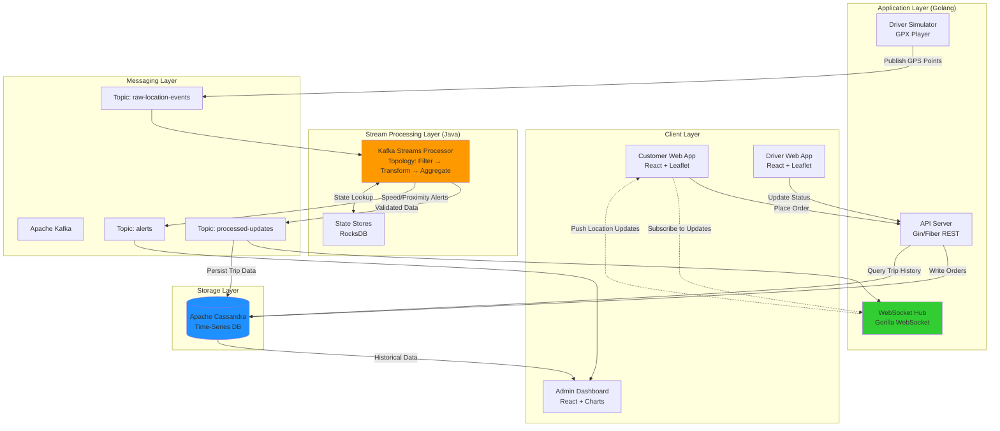
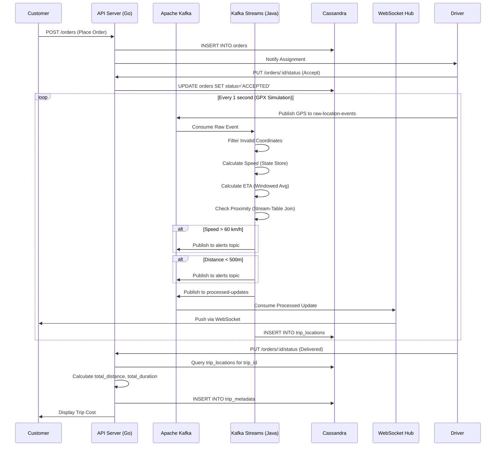
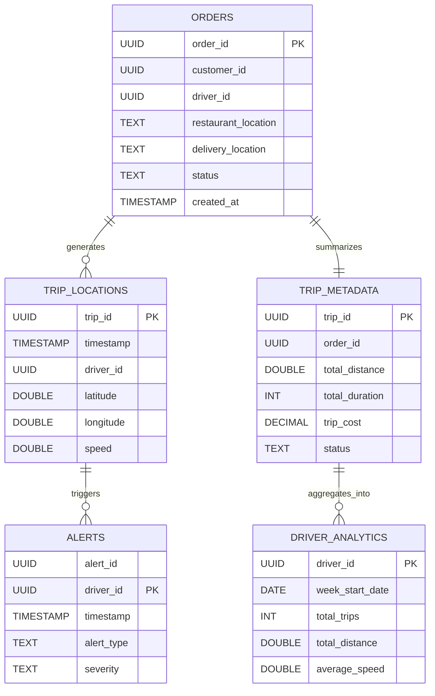
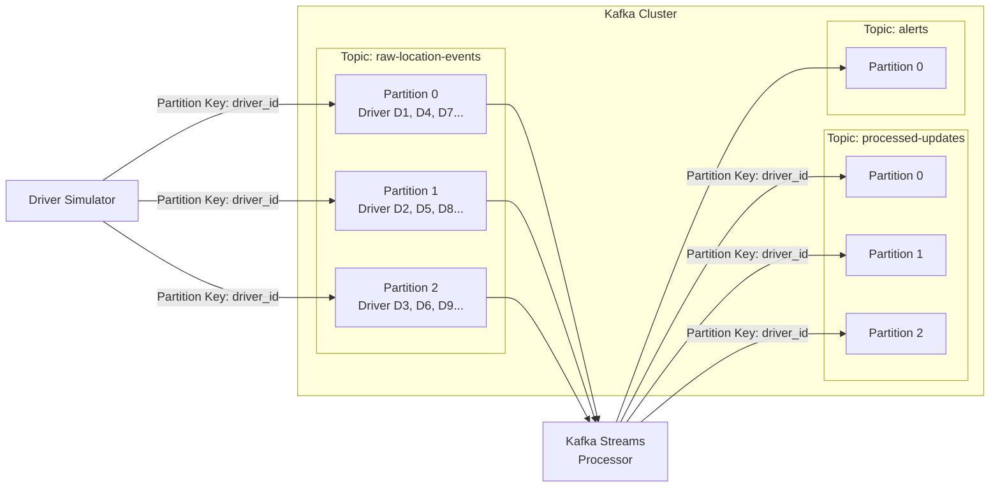

# Project Specification: Real-Time Delivery Tracking System

**Course:** Data Engineering (CO5173)
**Application Domain:** Transportation & Supply Chain Management
**Date:** Semester 2 - 2025-2026

---

## 1. Executive Summary

This project builds a **data-intensive, event-driven delivery tracking application** that simulates a real-world food delivery or ride-hailing service (similar to Uber Eats, Grab Food). The system demonstrates end-to-end data engineering principles with three interactive actors:

- **Customers** who place orders and track their delivery in real-time
- **Drivers** who accept orders and navigate to destinations
- **Admins (Optional)** who analyze operational metrics

The system adopts a high-performance **polyglot architecture** optimized for streaming data:

- **Golang** for high-concurrency data ingestion and WebSocket-based real-time serving
- **Java + Kafka Streams** for stateful stream processing (ETA calculation, proximity detection)
- **Apache Cassandra** for massive-scale time-series storage
- **React + Leaflet** for interactive map-based user interfaces

**Key Data Engineering Focus:** The project emphasizes how **Kafka Streams** and **Cassandra** work together to support real-time features (live tracking, dynamic ETA) and analytical features (trip history, performance analytics).

## 2. User Groups & Application Actors

The application simulates three distinct user roles with interactive workflows:

### 2.1 Customer (Primary Actor)

**User Story:** "As a customer, I want to place an order, see my assigned driver on a map, and watch their real-time location as they approach my delivery address."

**Key Interactions:**

- Place a new delivery order (one-click button)
- View assigned driver details (name, vehicle, photo)
- Track driver location in real-time on an interactive map
- View dynamic ETA updates (e.g., "Driver arriving in 5 minutes")
- Receive proximity notifications ("Driver is 500m away")

**Data Consumed:**

- Real-time driver location from Kafka (`processed-updates` topic)
- ETA calculations from Kafka Streams
- Order status from Cassandra (`orders` table)

### 2.2 Driver (Primary Actor)

**User Story:** "As a driver, I want to receive order assignments, update my delivery status, and have my route automatically logged for payment calculation."

**Key Interactions:**

- View incoming order requests
- Accept/reject order assignments
- Update delivery status: `ACCEPTED` → `PICKING_UP` → `IN_TRANSIT` → `ARRIVING` → `DELIVERED`
- Automatic GPS tracking while navigating (simulated via GPX file playback)

**Data Produced:**

- GPS coordinates streamed to Kafka (`raw-location-events` topic)
- Order status updates written to Cassandra (`orders` table)
- Trip completion triggers final cost calculation

**Data Consumed:**

- Order details from Cassandra (`orders` table)
- Navigation instructions (destination coordinates)

### 2.3 Admin (Optional Actor)

**User Story:** "As a fleet manager, I want to analyze driver performance, identify speeding violations, and optimize service areas based on demand patterns."

**Key Features:**

- View aggregated driver analytics (distance traveled, average speed, idle time)
- Monitor real-time safety alerts (speeding violations)
- Visualize service area heatmaps (high-demand zones)
- Playback historical trip routes for dispute resolution

**Data Consumed:**

- Historical trip data from Cassandra (`trip_locations`, `trip_metadata` tables)
- Aggregated metrics from Cassandra (`driver_analytics` table)
- Alert events from Kafka (`alerts` topic)

## 3. Business Requirements

_Constraint: Group of 4 members × 2 requirements = 8 total requirements._

### A. Real-Time Processing Requirements (Powered by Kafka Streams)

_These requirements demonstrate stateful stream processing using the Java Kafka Streams library._

1.  **Real-Time Location Tracking:**
    - **Data Flow:** Driver GPS coordinates → Kafka (`raw-location-events`) → Kafka Streams (filter/validate) → Kafka (`processed-updates`) → WebSocket → Customer UI
    - **Kafka Streams Role:** Filters out invalid coordinates (lat/lng bounds, accuracy threshold), deduplicates rapid-fire events
    - **Demo Scenario:** Customer sees driver marker move smoothly on map as driver follows GPX route

2.  **Dynamic ETA Calculation:**
    - **Data Flow:** Location stream → Kafka Streams (windowed aggregation) → Calculate moving average speed → Compute distance to destination → Publish ETA
    - **Kafka Streams Role:** Uses **windowed aggregation** (tumbling window of 30 seconds) to calculate average speed from recent GPS points. Applies **haversine formula** for distance calculation
    - **Demo Scenario:** Customer sees "Arriving in 8 minutes" countdown updating every 10 seconds as driver progresses

3.  **Safety & Speed Limit Monitoring:**
    - **Data Flow:** Location stream → Kafka Streams (calculate velocity) → Compare against threshold (60 km/h) → Publish alert to `alerts` topic → Admin dashboard
    - **Kafka Streams Role:** Computes instantaneous speed using consecutive GPS points with **stateful processing** (stores previous location in state store)
    - **Demo Scenario:** Admin dashboard shows real-time alert "Driver #123 exceeded speed limit: 75 km/h detected"

4.  **Proximity Alerts (Geofencing):**
    - **Data Flow:** Location stream → Kafka Streams (calculate distance to destination) → Trigger alert when <500m → Publish to `alerts` topic → Customer notification
    - **Kafka Streams Role:** Maintains destination coordinates in **KTable** (lookup table), performs **stream-table join** to check distance on every location update
    - **Demo Scenario:** Customer receives push notification "Your driver is approaching! ETA 2 minutes"

### B. Data Management & Analytics Requirements (Powered by Cassandra)

_These requirements demonstrate time-series data modeling and analytical query patterns._

5.  **Trip History & Route Playback:**
    - **Cassandra Schema:** `trip_locations` table partitioned by `trip_id`, clustered by `timestamp DESC`
    - **Query Pattern:** `SELECT * FROM trip_locations WHERE trip_id = ? ORDER BY timestamp ASC`
    - **Demo Scenario:** Admin clicks "Replay Trip #456" → Map animates the complete route from pickup to delivery

6.  **Driver Performance Analytics:**
    - **Cassandra Schema:** `driver_analytics` table partitioned by `driver_id`, clustered by `week_start_date DESC`
    - **Aggregation Logic:** Batch job (or Kafka Streams) aggregates completed trips weekly: SUM(distance), AVG(speed), COUNT(speeding_violations)
    - **Demo Scenario:** Admin views dashboard showing "Driver John: 523 km traveled, 42 trips, 3 speeding incidents this week"

7.  **Automated Delivery Cost Calculation:**
    - **Cassandra Schema:** `trip_metadata` table stores `total_distance` (km) and `total_duration` (seconds) calculated from `trip_locations`
    - **Calculation Logic:** `cost = base_fare + (distance_rate × total_distance) + (time_rate × total_duration)`
    - **Demo Scenario:** After driver marks order as "DELIVERED", system displays "Trip Cost: $12.50 (8.3 km, 22 minutes)"

8.  **Service Area Heatmaps:**
    - **Cassandra Schema:** Query `trip_locations` table filtering by `timestamp` range, aggregate by geo-hash or coordinate clustering
    - **Visualization:** Use density-based clustering to identify high-demand drop-off zones
    - **Demo Scenario:** Admin sees heatmap overlay on map showing "Downtown area: 342 deliveries this week" (hotspot in red)

## 4. Demo Scenario Workflow

### 4.1 End-to-End Demo Flow (2 Concurrent Users)

**Setup:**

- **User A (Customer):** Opens web app, places order for food delivery
- **User B (Driver):** Opens driver app, waits for order assignment

**Step-by-Step Flow:**

1. **Customer Places Order** (User A)
   - Clicks "Place Order" button
   - System creates order record in Cassandra `orders` table
   - Order status: `PENDING`
   - System assigns nearest available driver (User B)

2. **Driver Receives Assignment** (User B)
   - Driver app displays notification: "New order from Restaurant XYZ to 123 Main St"
   - Driver clicks "Accept Order"
   - System updates order status to `ACCEPTED` in Cassandra
   - Driver simulator starts playing GPX file (simulates driver movement)

3. **Real-Time Tracking Begins** (User A)
   - Customer map shows driver icon appear at restaurant location
   - GPX simulator publishes GPS coordinates to Kafka `raw-location-events` topic (1 point/second)
   - Kafka Streams processes each location:
     - Filters invalid coordinates
     - Calculates current speed and ETA
     - Publishes to `processed-updates` topic
   - WebSocket pushes updates to customer browser
   - **Observable:** Driver marker moves smoothly along the route on customer's map

4. **Dynamic ETA Updates** (User A)
   - Customer sees ETA countdown: "Arriving in 12 minutes"
   - As driver progresses, Kafka Streams recalculates:
     - Distance remaining = haversine(current_location, destination)
     - Average speed = moving average of last 30 seconds
     - ETA = (distance / speed) × 3600 seconds
   - **Observable:** ETA updates every 10 seconds: "12 min" → "10 min" → "8 min"

5. **Speed Monitoring Alert** (Admin Dashboard - Optional)
   - Driver momentarily exceeds 65 km/h on highway
   - Kafka Streams detects violation (speed > 60 km/h threshold)
   - Publishes alert to `alerts` Kafka topic
   - **Observable:** Admin dashboard shows notification "Driver B speeding: 65 km/h"

6. **Proximity Notification** (User A)
   - Driver enters 500m radius of destination
   - Kafka Streams (via stream-table join with destination coordinates):
     - Calculates distance = 480m
     - Triggers proximity alert
   - Customer receives notification: "Your driver is approaching!"
   - **Observable:** Toast notification appears on customer screen

7. **Driver Status Updates** (User B)
   - Driver arrives at destination, clicks "Mark as Arriving"
   - System updates order status to `ARRIVING` in Cassandra
   - Driver completes delivery, clicks "Mark as Delivered"
   - System updates order status to `DELIVERED`

8. **Trip Completion & Cost Calculation** (System)
   - System queries `trip_locations` table for all GPS points of this trip
   - Calculates:
     - Total distance = SUM(haversine between consecutive points)
     - Total duration = MAX(timestamp) - MIN(timestamp)
     - Trip cost = $3.00 (base) + ($0.50/km × 8.3 km) + ($0.10/min × 22 min) = $9.35
   - Writes to `trip_metadata` table
   - **Observable:** Customer sees "Delivery Complete! Trip Cost: $9.35"

9. **Historical Playback** (Admin - Optional)
   - Admin selects completed trip from list
   - Clicks "Replay Route"
   - System fetches: `SELECT * FROM trip_locations WHERE trip_id = ? ORDER BY timestamp ASC`
   - Map animates driver movement from start to finish
   - **Observable:** Admin watches time-lapsed replay showing exact route taken

## 5. System & Data Architecture

### 5.1. Technology Stack

| Component         | Technology          | Language       | Justification                                                                                                      |
| :---------------- | :------------------ | :------------- | :----------------------------------------------------------------------------------------------------------------- |
| **Ingestion**     | Kafka Producer      | **Golang**     | **Goroutines** allow simulating thousands of concurrent drivers from a single machine with minimal resource usage. |
| **Processing**    | **Kafka Streams**   | **Java**       | Native support for stateful stream processing (Windowing, KTable, State Stores) with sub-millisecond latency.      |
| **Storage**       | Apache Cassandra    | CQL            | Best-in-class write throughput for time-series data; linear scalability for massive write loads.                   |
| **Serving (API)** | **Gin/Fiber**       | **Golang**     | High-performance REST and WebSocket handling; shares data models with Ingestion layer for type safety.             |
| **Frontend**      | **React + Leaflet** | **JavaScript** | Component-based architecture for efficient rendering of dynamic map markers; rich ecosystem for real-time updates. |

### 5.2. High-Level Architecture Diagram



### 5.3. Data Flow Architecture



### 5.4. Data Ingestion: Golang Driver Simulator

- **Role:** GPS Data Generator (simulates real drivers using GPX files)
- **Implementation:** Command-line tool: `go run cmd/simulator/main.go --gpx-file=route.gpx --driver-id=D123`
- **Concurrency Model:**
  - Spawns one **goroutine** per active driver
  - Each goroutine:
    1. Parses GPX XML file (`<trkpt lat="..." lon="...">`)
    2. Extracts GPS points with timestamps
    3. Publishes JSON messages to Kafka `raw-location-events` topic
    4. Sleeps between points to simulate real-time movement (e.g., 1 second intervals)
- **Why Golang:**
  - Can simulate 10,000+ drivers on a laptop (goroutines are lightweight)
  - Type-safe JSON serialization prevents malformed Kafka messages

**Sample Output:**

```json
{
  "driver_id": "D123",
  "trip_id": "T456",
  "timestamp": "2024-01-30T10:15:32Z",
  "latitude": 10.762622,
  "longitude": 106.660172,
  "speed": 45.5,
  "heading": 90,
  "accuracy": 5.0
}
```

### 5.5. Stream Processing: Kafka Streams (Java)

- **Role:** Real-Time Event Processing Engine ("The Brain")
- **Implementation:** Standalone Java application using Kafka Streams DSL
- **Processing Topology:**

```
Input: raw-location-events
   ↓
[1] Filter Invalid Coordinates
   ↓ (lat/lng bounds, accuracy > 20m)
[2] Calculate Speed (Stateful)
   ↓ (velocity = distance / time_delta, uses State Store)
[3] Windowed Aggregation (30-second tumbling window)
   ↓ (calculate moving average speed)
[4] Join with Destination (KTable)
   ↓ (lookup destination coordinates from orders table)
[5] Branch:
   ├─→ Speed > 60 km/h? → Publish to alerts topic
   ├─→ Distance < 500m? → Publish to alerts topic
   └─→ Valid location → Publish to processed-updates topic
```

**Key Kafka Streams Concepts Demonstrated:**

1. **Stateful Processing:** Store previous GPS point in RocksDB state store to calculate velocity
2. **Windowed Aggregations:** Tumbling window (30s) to compute moving average speed
3. **Stream-Table Joins:** Join location stream with KTable of destination coordinates
4. **Branching:** Split stream based on business rules (speeding, proximity)

**Why Java + Kafka Streams:**

- Native integration with Kafka (no external processing framework needed)
- Exactly-once semantics for critical calculations (ETA, billing)
- Low latency (microsecond-level processing)

### 5.6. Data Storage: Apache Cassandra Schema

**Design Principles:**

- Optimize for **write-heavy workload** (1,000+ GPS points/second)
- Partition by entity ID (`trip_id`, `driver_id`) for query isolation
- Cluster by timestamp for time-series ordering
- Denormalize data for read efficiency

#### **Table 1: orders**

```sql
CREATE TABLE orders (
    order_id UUID PRIMARY KEY,
    customer_id UUID,
    driver_id UUID,
    restaurant_location TEXT,      -- "lat,lng"
    delivery_location TEXT,         -- "lat,lng"
    status TEXT,                    -- PENDING, ACCEPTED, IN_TRANSIT, DELIVERED
    created_at TIMESTAMP,
    updated_at TIMESTAMP
);
```

**Query Pattern:** `SELECT * FROM orders WHERE order_id = ?`
**Purpose:** Track order lifecycle, assign drivers, store destination coordinates

#### **Table 2: trip_locations**

```sql
CREATE TABLE trip_locations (
    trip_id UUID,
    timestamp TIMESTAMP,
    driver_id UUID,
    order_id UUID,
    latitude DOUBLE,
    longitude DOUBLE,
    speed DOUBLE,
    heading DOUBLE,
    accuracy DOUBLE,
    PRIMARY KEY (trip_id, timestamp)
) WITH CLUSTERING ORDER BY (timestamp DESC);
```

**Query Patterns:**

- `SELECT * FROM trip_locations WHERE trip_id = ? ORDER BY timestamp ASC` (Route Playback)
- `SELECT * FROM trip_locations WHERE trip_id = ? LIMIT 1` (Latest Location)

**Purpose:** Store full GPS trace for every trip (millions of rows per day)

**Why Partition by `trip_id`:**

- Each trip's data stays on one Cassandra node
- Fast retrieval of entire trip route (no cross-node queries)
- Efficient route playback animation

#### **Table 3: trip_metadata**

```sql
CREATE TABLE trip_metadata (
    trip_id UUID PRIMARY KEY,
    driver_id UUID,
    order_id UUID,
    start_time TIMESTAMP,
    end_time TIMESTAMP,
    start_location TEXT,
    destination TEXT,
    total_distance DOUBLE,           -- km (calculated from trip_locations)
    total_duration INT,              -- seconds
    average_speed DOUBLE,            -- km/h
    max_speed DOUBLE,
    speeding_violations INT,
    trip_cost DECIMAL,
    status TEXT                      -- ACTIVE, COMPLETED, CANCELLED
);
```

**Query Pattern:** `SELECT * FROM trip_metadata WHERE trip_id = ?`
**Purpose:** Aggregate trip statistics for billing and analytics

**Data Flow:**

1. When trip starts → INSERT with `status='ACTIVE'`
2. When trip ends:
   - Query all rows from `trip_locations` for this `trip_id`
   - Calculate `total_distance` (sum of haversine distances)
   - Calculate `total_duration` (max timestamp - min timestamp)
   - Calculate `trip_cost` using pricing formula
   - UPDATE with final values

#### **Table 4: driver_analytics**

```sql
CREATE TABLE driver_analytics (
    driver_id UUID,
    week_start_date DATE,           -- e.g., 2024-01-29 (Monday)
    total_trips INT,
    total_distance DOUBLE,          -- km
    total_duration INT,             -- seconds
    average_speed DOUBLE,           -- km/h
    speeding_violations INT,
    idle_time INT,                  -- seconds (time between trips)
    PRIMARY KEY (driver_id, week_start_date)
) WITH CLUSTERING ORDER BY (week_start_date DESC);
```

**Query Pattern:** `SELECT * FROM driver_analytics WHERE driver_id = ? AND week_start_date >= '2024-01-01'`
**Purpose:** Weekly performance reports for fleet management

**Aggregation Strategy:**

- **Option 1:** Batch job runs weekly (Sunday midnight) to aggregate from `trip_metadata`
- **Option 2:** Kafka Streams aggregates in real-time (more advanced)

#### **Table 5: alerts**

```sql
CREATE TABLE alerts (
    alert_id UUID,
    driver_id UUID,
    trip_id UUID,
    timestamp TIMESTAMP,
    alert_type TEXT,                -- SPEEDING, PROXIMITY, GEOFENCE
    severity TEXT,                  -- HIGH, MEDIUM, LOW
    message TEXT,
    metadata MAP<TEXT, TEXT>,       -- {"current_speed": "75", "limit": "60"}
    PRIMARY KEY (driver_id, timestamp, alert_id)
) WITH CLUSTERING ORDER BY (timestamp DESC);
```

**Query Pattern:** `SELECT * FROM alerts WHERE driver_id = ? AND timestamp >= ?`
**Purpose:** Audit trail of safety violations

### 5.7. Cassandra Data Model Diagram



### 5.8. API Server & WebSocket Hub (Golang)

**Role:** Bridge between storage/streaming layers and frontend

**REST API Endpoints:**

```
POST   /api/orders                    # Customer places order
GET    /api/orders/:id                # Get order details
PUT    /api/orders/:id/status         # Driver updates status

GET    /api/trips/:id                 # Get trip summary
GET    /api/trips/:id/route           # Get full GPS trace for playback

GET    /api/drivers/:id/analytics     # Get weekly performance stats
GET    /api/drivers/:id/alerts        # Get safety violations

GET    /api/admin/heatmap             # Get delivery density by zone
```

**WebSocket Protocol:**

```javascript
// Client subscribes to driver updates
ws.send(JSON.stringify({
  action: "subscribe",
  driver_id: "D123"
}));

// Server pushes real-time location (from processed-updates Kafka topic)
{
  "type": "location_update",
  "driver_id": "D123",
  "latitude": 10.762622,
  "longitude": 106.660172,
  "speed": 45.5,
  "eta_seconds": 420
}

// Server pushes proximity alert (from alerts Kafka topic)
{
  "type": "alert",
  "alert_type": "proximity",
  "message": "Driver is 480m away"
}
```

**Implementation Details:**

- **Kafka Consumer:** Goroutine consumes `processed-updates` topic in background
- **WebSocket Hub:** Maintains map of `driver_id → []WebSocketConnection`
- **Broadcasting:** When message arrives from Kafka, lookup all subscribers and push via WebSocket
- **Concurrency:** Uses channels and goroutines for non-blocking message distribution

## 6. Kafka Topics Architecture

### 6.1. Topic Design & Partitioning Strategy



### 6.2. Topic Specifications

| Topic                 | Partitions | Replication | Retention | Key         | Purpose                                       |
| --------------------- | ---------- | ----------- | --------- | ----------- | --------------------------------------------- |
| `raw-location-events` | 3          | 2           | 24 hours  | `driver_id` | Unprocessed GPS coordinates from simulator    |
| `processed-updates`   | 3          | 2           | 7 days    | `driver_id` | Validated locations with ETA calculations     |
| `alerts`              | 1          | 2           | 30 days   | `driver_id` | Safety violations and proximity notifications |

**Why Partition by `driver_id`:**

- Guarantees ordering of events for same driver
- Kafka Streams can maintain stateful processing per driver
- Enables parallel processing across multiple stream tasks

### 6.3. Message Schemas

#### **raw-location-events Schema**

```json
{
  "driver_id": "D123",
  "trip_id": "T456",
  "order_id": "O789",
  "timestamp": "2024-01-30T10:15:32.123Z",
  "latitude": 10.762622,
  "longitude": 106.660172,
  "speed": 45.5,
  "heading": 90,
  "altitude": 15.2,
  "accuracy": 5.0
}
```

#### **processed-updates Schema**

```json
{
  "driver_id": "D123",
  "trip_id": "T456",
  "order_id": "O789",
  "timestamp": "2024-01-30T10:15:32.123Z",
  "location": {
    "latitude": 10.762622,
    "longitude": 106.660172
  },
  "speed": 45.5,
  "heading": 90,
  "eta_seconds": 420,
  "distance_to_destination": 3.2,
  "is_speeding": false
}
```

#### **alerts Schema**

```json
{
  "alert_id": "A001",
  "driver_id": "D123",
  "trip_id": "T456",
  "timestamp": "2024-01-30T10:15:32.123Z",
  "alert_type": "SPEEDING",
  "severity": "HIGH",
  "message": "Speed limit exceeded: 75 km/h in 60 km/h zone",
  "metadata": {
    "current_speed": "75",
    "speed_limit": "60",
    "location": "10.762622,106.660172"
  }
}
```

## 7. How Data Engineering Components Support Demo Features

### 7.1. Real-Time Location Tracking

**Kafka Streams Contribution:**

- **Filter Topology:** Removes GPS points with accuracy >20m, invalid lat/lng
- **Deduplication:** Uses state store to drop duplicate events within 500ms window
- **Output:** Clean, validated location stream

**Cassandra Contribution:**

- **Write Pattern:** INSERT into `trip_locations` (append-only, high throughput)
- **Query Pattern:** Latest location for historical analysis

**Observable Result:** Smooth, jitter-free movement on customer's map

### 7.2. Dynamic ETA Calculation

**Kafka Streams Contribution:**

- **Windowed Aggregation:**
  ```java
  stream
    .groupByKey()
    .windowedBy(TimeWindows.of(Duration.ofSeconds(30)))
    .aggregate(
      SpeedAccumulator::new,
      (key, value, aggregate) -> aggregate.add(value.speed),
      Materialized.as("speed-window-store")
    )
    .mapValues(SpeedAccumulator::average)
  ```
- **Stream-Table Join:** Join location with destination from KTable
- **Haversine Calculation:** Distance = haversine(current, destination)
- **ETA Formula:** `(distance_km / avg_speed_kmh) × 3600`

**Observable Result:** ETA updates every 10 seconds: "12 min" → "10 min"

### 7.3. Speed Monitoring

**Kafka Streams Contribution:**

- **Stateful Processor:**
  ```java
  context.getStateStore("previous-location")
  distance = haversine(current, previous)
  time_delta = current.timestamp - previous.timestamp
  velocity = (distance / time_delta) × 3600  // km/h
  if (velocity > 60) publishAlert()
  ```

**Cassandra Contribution:**

- **Alert Storage:** INSERT into `alerts` table for audit trail

**Observable Result:** Admin sees alert notification in real-time

### 7.4. Proximity Detection

**Kafka Streams Contribution:**

- **Stream-Table Join:**
  ```java
  locationStream
    .join(destinationTable,
      (location, destination) -> {
        double distance = haversine(location, destination);
        return new ProximityCheck(distance);
      })
    .filter((key, check) -> check.distance < 0.5) // 500m
    .to("alerts")
  ```

**Observable Result:** Customer receives "Driver approaching!" notification

### 7.5. Trip History & Route Playback

**Cassandra Contribution:**

- **Schema Design:** Partition by `trip_id`, cluster by `timestamp DESC`
- **Query:** Fetches all GPS points in time order
- **Data Volume:** Handles millions of rows (10k drivers × 1 point/sec × 24 hrs = 864M points/day)

**Observable Result:** Admin watches animated replay of driver's exact route

### 7.6. Driver Performance Analytics

**Cassandra Contribution:**

- **Aggregation Query:**
  ```sql
  SELECT SUM(total_distance), AVG(average_speed), SUM(speeding_violations)
  FROM trip_metadata
  WHERE driver_id = ? AND end_time >= '2024-01-29' AND end_time < '2024-02-05'
  ```
- **Pre-aggregated Table:** `driver_analytics` for fast dashboard queries

**Alternative (Advanced):** Use Kafka Streams for real-time aggregation

**Observable Result:** Admin dashboard: "Driver John: 523 km, avg 38 km/h, 3 violations"

### 7.7. Cost Calculation

**Cassandra Contribution:**

1. Query `trip_locations` for trip's GPS points
2. Calculate distance using haversine formula between consecutive points
3. Calculate duration from timestamps
4. Apply pricing: `$3.00 + ($0.50/km × distance) + ($0.10/min × duration)`
5. Store in `trip_metadata.trip_cost`

**Observable Result:** "Delivery Complete! Cost: $9.35 (8.3 km, 22 min)"

## 8. Alternative Solutions (Benchmarking)

To justify technology choices, we compared our selected stack against alternatives:

### 8.1. Ingestion: Golang vs Python

| Feature              | Selected: **Golang**                                                                 | Alternative: **Python**                                                            |
| :------------------- | :----------------------------------------------------------------------------------- | :--------------------------------------------------------------------------------- |
| **Simulation Scale** | **High:** Can simulate 10,000+ concurrent drivers using goroutines.                  | **Low:** Threads are heavy; Global Interpreter Lock (GIL) limits true concurrency. |
| **Type Safety**      | **Strong:** JSON structs defined at compile time. Prevents malformed Kafka messages. | **Weak:** Easy to accidentally send wrong types (string vs float for lat/lng).     |
| **Performance**      | **Compiled:** Extremely fast startup and execution.                                  | **Interpreted:** Slower file parsing for massive GPX datasets.                     |
| **Memory Footprint** | ~2 MB per goroutine (can run 10k on 20 GB RAM)                                       | ~50 MB per thread (max ~400 threads on 20 GB RAM)                                  |

### 8.2. Stream Processing: Kafka Streams vs Spark Streaming

| Feature              | Selected: **Kafka Streams**                                     | Alternative: **Spark Streaming**                               |
| :------------------- | :-------------------------------------------------------------- | :------------------------------------------------------------- |
| **Latency**          | **Microseconds** (processes record-at-a-time)                   | **Seconds** (micro-batching)                                   |
| **Deployment**       | **Simple:** Runs as standalone JAR, no cluster management       | **Complex:** Requires Spark cluster (master + workers)         |
| **State Management** | **Built-in:** RocksDB state stores for windowing/joins          | **External:** Requires Cassandra/Redis for state               |
| **Exactly-Once**     | **Native:** Kafka transactions ensure exactly-once processing   | **Best-effort:** May require idempotent writes                 |
| **Use Case Fit**     | **Perfect:** Real-time ETA updates, sub-second proximity alerts | **Overkill:** Better for batch analytics, not real-time events |

### 8.3. Storage: Cassandra vs PostgreSQL

| Feature              | Selected: **Cassandra**                                 | Alternative: **PostgreSQL**                                    |
| :------------------- | :------------------------------------------------------ | :------------------------------------------------------------- |
| **Write Throughput** | **1M+ writes/sec** (linear scalability)                 | **10k writes/sec** (single node bottleneck)                    |
| **Scalability**      | **Horizontal:** Add nodes for linear capacity increase  | **Vertical:** Requires bigger machines, replication is complex |
| **Time-Series Fit**  | **Native:** Clustering keys optimize time-range queries | **Requires partitioning:** Manual table partitioning by date   |
| **Availability**     | **No single point of failure** (multi-node replication) | **Primary-replica:** Failover requires intervention            |

**Conclusion:** Cassandra is optimal for write-heavy, time-series workload (1,000+ GPS points/second).

## 9. Deliverables & Implementation Roadmap

### Week 1: Infrastructure & Data Ingestion (Golang)

- **Tasks:**
  - Setup Docker Compose for Kafka + Zookeeper + Cassandra
  - Create Cassandra keyspace and tables (`orders`, `trip_locations`, `trip_metadata`, `driver_analytics`, `alerts`)
  - Develop Golang GPX parser
  - Implement Kafka Producer: `cmd/simulator/main.go`
  - Test: Simulate 10 concurrent drivers publishing to Kafka
- **Deliverables:**
  - `docker-compose.yml` with all services
  - Working Kafka producer CLI tool
  - Documentation: `docs/setup-guide.md`

### Week 2: Stream Processing (Java)

- **Tasks:**
  - Initialize Java project with Kafka Streams dependency
  - Implement processing topology:
    - Filter invalid coordinates
    - Stateful speed calculation
    - Windowed aggregation for average speed
    - Stream-table join for proximity detection
  - Configure state stores (RocksDB)
  - Publish to `processed-updates` and `alerts` topics
  - Test: Verify ETA calculations and alert triggers
- **Deliverables:**
  - Runnable JAR: `stream-processor.jar`
  - Unit tests for topology
  - Documentation: `docs/stream-processing.md`

### Week 3: API Development & Storage (Golang)

- **Tasks:**
  - Implement REST API with Gin framework
  - Implement Cassandra DAO using `gocql` driver
  - Implement WebSocket Hub:
    - Kafka consumer for `processed-updates`
    - Connection manager for subscriber tracking
    - Broadcast logic for real-time push
  - Implement cost calculation logic
  - Test: API integration tests
- **Deliverables:**
  - API server: `cmd/api/main.go`
  - Postman collection for endpoints
  - Documentation: `docs/api-reference.md`

### Week 4: Frontend Implementation (React)

- **Tasks:**
  - Initialize React project with Vite
  - Integrate `react-leaflet` for OpenStreetMap
  - Implement customer view:
    - Order placement button
    - Real-time driver tracking map
    - ETA display and proximity notifications
  - Implement driver view:
    - Order acceptance interface
    - Status update buttons
  - Implement admin dashboard (optional):
    - Trip history playback
    - Analytics charts
  - Connect WebSocket client to API
- **Deliverables:**
  - Deployable React app
  - User documentation
  - Demo video showing end-to-end flow

## 10. Evaluation Criteria & Success Metrics

### 10.1. Functional Requirements

- **✓ Order Placement:** Customer can create new delivery order
- **✓ Real-Time Tracking:** Customer sees driver location update every 1 second
- **✓ Dynamic ETA:** ETA recalculates every 10 seconds based on moving average speed
- **✓ Status Updates:** Driver can update order status (Accept → In Transit → Delivered)
- **✓ Proximity Alerts:** Customer receives notification when driver <500m away
- **✓ Speed Monitoring:** Admin sees alert when driver exceeds 60 km/h
- **✓ Trip Playback:** Admin can replay historical route on map
- **✓ Cost Calculation:** System calculates trip cost from actual GPS trace

### 10.2. Data Engineering Criteria

#### Kafka Streams Evaluation

- **Stateful Processing:** Demonstrates state store usage for speed calculation
- **Windowed Aggregations:** Uses tumbling window for moving average
- **Stream-Table Joins:** Joins location stream with destination KTable
- **Topology Complexity:** Multi-stage pipeline (filter → transform → aggregate → branch)

#### Cassandra Evaluation

- **Schema Design:** Proper partition keys (`trip_id`, `driver_id`) and clustering keys (`timestamp`)
- **Query Patterns:** Demonstrates time-series queries and aggregations
- **Write Performance:** Handles 1,000+ GPS points/second without lag
- **Data Volume:** Stores millions of rows demonstrating scalability

### 10.3. Performance Metrics

1.  **Throughput:** Simulate 100+ concurrent drivers without Kafka consumer lag
2.  **Latency:** End-to-end < 500ms (GPS publish → Kafka Streams → WebSocket → Browser)
3.  **Data Consistency:** Zero malformed messages in Kafka (Go type safety)
4.  **Availability:** System continues operating if 1 Cassandra node fails (RF=2)

### 10.4. Demo Presentation Checklist

- **✓ Live Demo:** Show 2 concurrent users (customer + driver) interacting
- **✓ Data Visualization:** Show Kafka topics in real-time (using Kafka UI)
- **✓ Database Queries:** Show CQL queries executing against live data
- **✓ Architecture Explanation:** Explain how Kafka Streams and Cassandra support each feature
- **✓ Code Walkthrough:** Show key code snippets (topology, state stores, CQL schema)

## 11. Data Engineering Focus Areas for Documentation

### 11.1. Kafka Streams Deep Dive

Document with code examples:

- State store configuration and usage
- Windowing strategies (tumbling vs hopping)
- Stream-table join implementation
- Exactly-once semantics configuration
- Performance tuning (parallelism, state store size)

### 11.2. Cassandra Deep Dive

Document with CQL examples:

- Partition key selection rationale
- Time-series data modeling patterns
- Read/write path optimization
- Consistency level trade-offs
- Compaction strategy for time-series data

### 11.3. System Integration

Document how components interact:

- Kafka topic design and partitioning strategy
- Producer/consumer configuration
- Serialization formats (JSON, Avro)
- Error handling and retry policies
- Monitoring and observability

---

**End of Specification**
