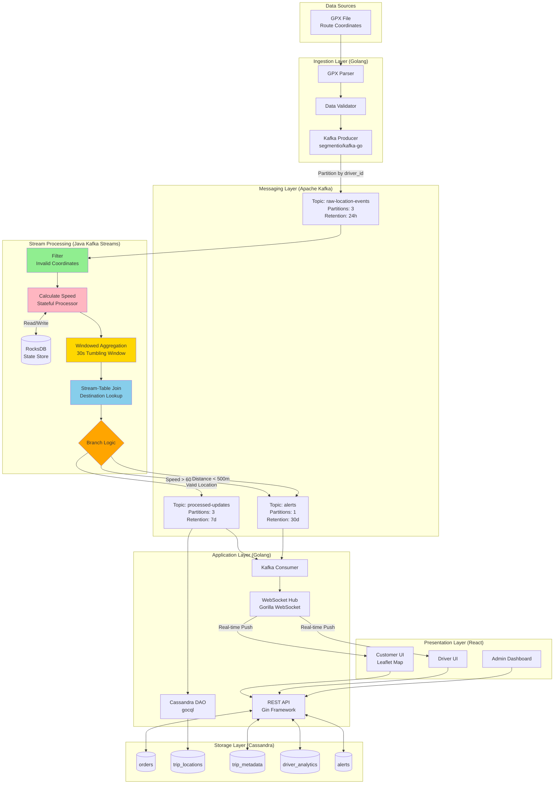
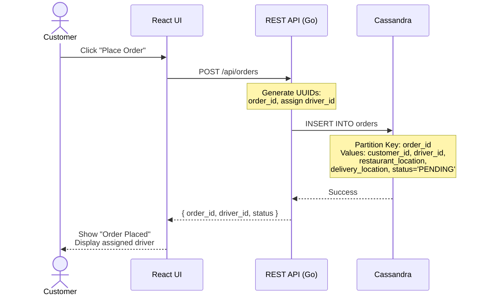
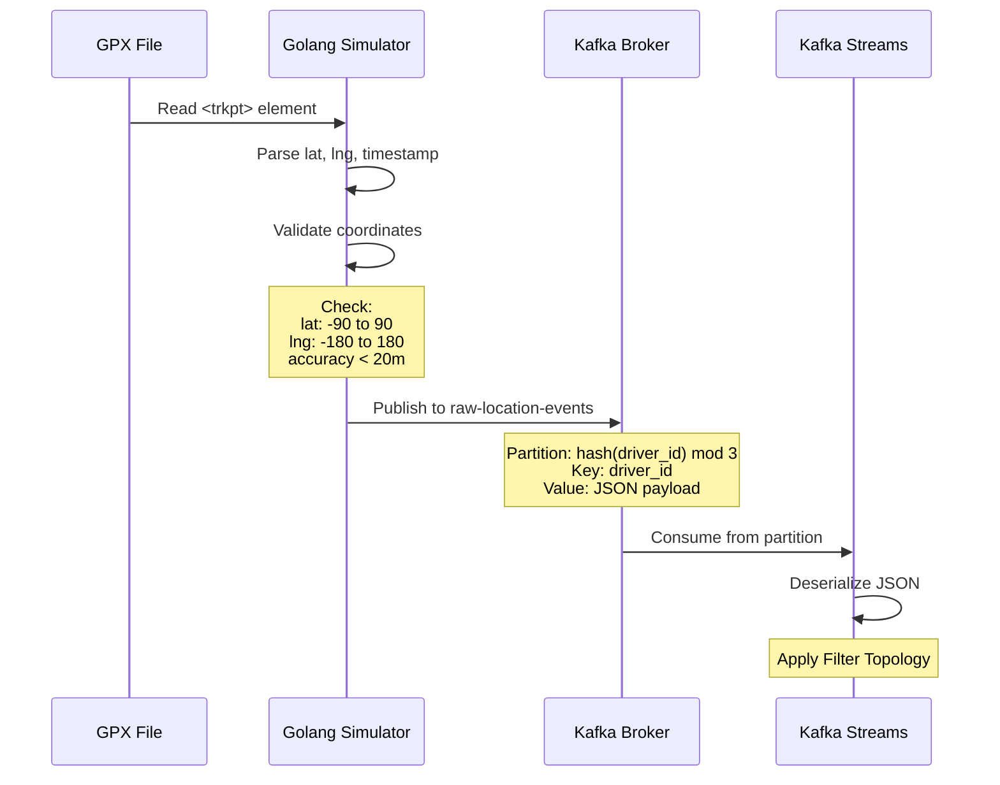
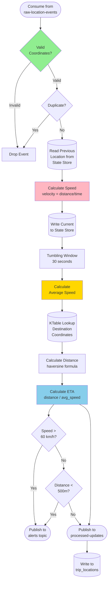
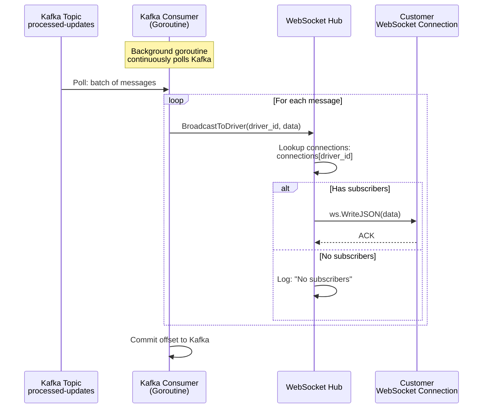
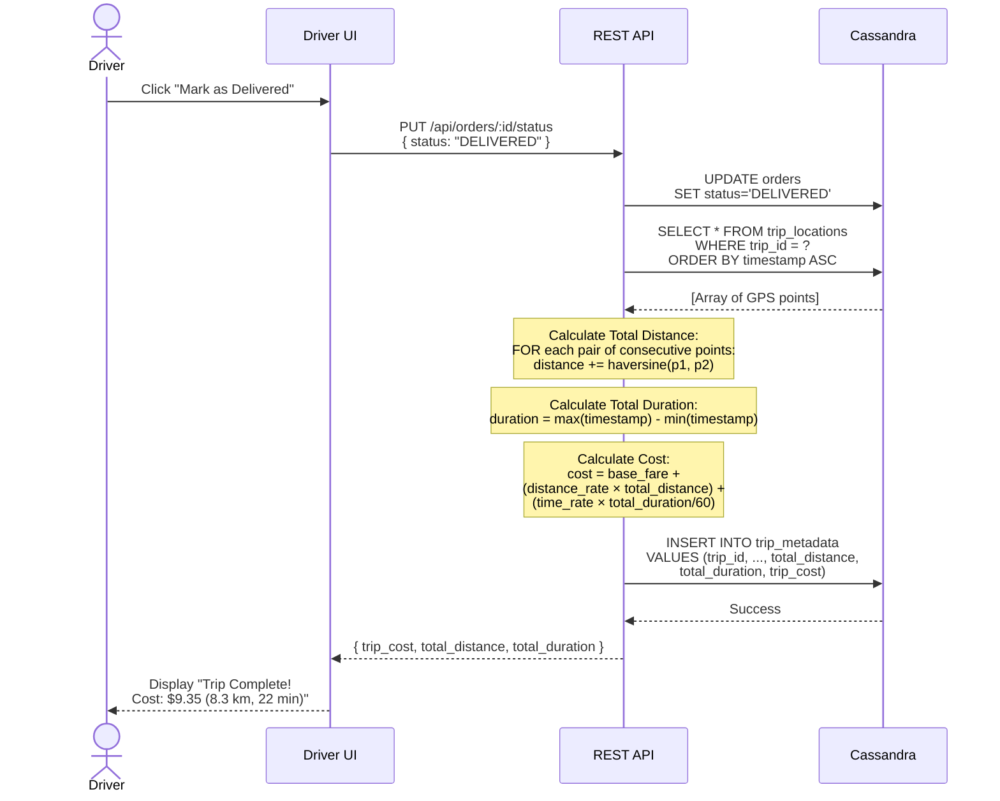

# Data Flow Documentation

**Version:** 2.0.0
**Last Updated:** 2026-01-30

## 1. Overview

This document details the complete data flow through the real-time delivery tracking system, from GPS data ingestion to visualization in the customer UI.

## 2. End-to-End Data Flow Diagram



## 3. Detailed Flow: Customer Places Order

### 3.1. Data Flow Steps



### 3.2. Data Structure

**Request (POST /api/orders):**
```json
{
  "customer_id": "C456",
  "restaurant_location": "10.762622,106.660172",
  "delivery_location": "10.782345,106.695123"
}
```

**Cassandra Insert:**
```sql
INSERT INTO orders (
  order_id, customer_id, driver_id,
  restaurant_location, delivery_location,
  status, created_at
) VALUES (
  uuid(), 'C456', 'D123',
  '10.762622,106.660172', '10.782345,106.695123',
  'PENDING', toTimestamp(now())
);
```

## 4. Detailed Flow: GPS Data Ingestion

### 4.1. Data Flow Steps



### 4.2. Data Structure

**GPX Input:**
```xml
<trkpt lat="10.762622" lon="106.660172">
  <time>2024-01-30T10:15:32Z</time>
  <speed>45.5</speed>
  <course>90</course>
</trkpt>
```

**Kafka Message (raw-location-events):**
```json
{
  "driver_id": "D123",
  "trip_id": "T456",
  "order_id": "O789",
  "timestamp": "2024-01-30T10:15:32.123Z",
  "latitude": 10.762622,
  "longitude": 106.660172,
  "speed": 45.5,
  "heading": 90,
  "altitude": 15.2,
  "accuracy": 5.0
}
```

## 5. Detailed Flow: Stream Processing

### 5.1. Kafka Streams Topology



### 5.2. Processing Logic Details

#### Filter Invalid Coordinates
```java
stream.filter((key, value) -> {
    double lat = value.getLatitude();
    double lng = value.getLongitude();
    double accuracy = value.getAccuracy();

    return lat >= -90 && lat <= 90 &&
           lng >= -180 && lng <= 180 &&
           accuracy <= 20.0;
});
```

#### Calculate Speed (Stateful)
```java
stream.transformValues(() -> new ValueTransformerWithKey<String, Location, EnrichedLocation>() {
    private KeyValueStore<String, Location> stateStore;

    @Override
    public void init(ProcessorContext context) {
        stateStore = context.getStateStore("previous-location-store");
    }

    @Override
    public EnrichedLocation transform(String driverId, Location current) {
        Location previous = stateStore.get(driverId);

        if (previous == null) {
            stateStore.put(driverId, current);
            return new EnrichedLocation(current, 0.0);
        }

        double distance = haversine(previous, current);  // km
        long timeDelta = current.timestamp - previous.timestamp;  // ms
        double speed = (distance / (timeDelta / 1000.0)) * 3600;  // km/h

        stateStore.put(driverId, current);
        return new EnrichedLocation(current, speed);
    }
}, "previous-location-store");
```

#### Windowed Aggregation for Average Speed
```java
stream
    .groupByKey()
    .windowedBy(TimeWindows.ofSizeWithNoGrace(Duration.ofSeconds(30)))
    .aggregate(
        SpeedAccumulator::new,
        (key, value, aggregate) -> aggregate.add(value.getSpeed()),
        Materialized.<String, SpeedAccumulator, WindowStore<Bytes, byte[]>>as("speed-window-store")
            .withKeySerde(Serdes.String())
            .withValueSerde(speedAccumulatorSerde)
    )
    .toStream()
    .mapValues(SpeedAccumulator::average);
```

#### Stream-Table Join for Proximity
```java
KTable<String, Destination> destinationTable = builder.table(
    "destinations",
    Consumed.with(Serdes.String(), destinationSerde)
);

enrichedStream
    .join(destinationTable,
        (location, destination) -> {
            double distance = haversine(
                location.getLatitude(), location.getLongitude(),
                destination.getLatitude(), destination.getLongitude()
            );
            return new ProximityResult(location, destination, distance);
        },
        Joined.with(Serdes.String(), locationSerde, destinationSerde)
    )
    .filter((key, result) -> result.getDistance() < 0.5)  // 500m
    .to("proximity-alerts");
```

## 6. Detailed Flow: Real-Time Push to Customer

### 6.1. WebSocket Flow



### 6.2. WebSocket Hub Implementation (Golang)

```go
type Hub struct {
    connections map[string][]*websocket.Conn  // driver_id -> connections
    register    chan *Subscription
    unregister  chan *Subscription
    broadcast   chan *Message
    mu          sync.RWMutex
}

type Message struct {
    DriverID string
    Data     interface{}
}

func (h *Hub) Run() {
    // Kafka consumer goroutine
    go func() {
        for {
            msg := kafkaConsumer.ReadMessage(context.Background())
            var update LocationUpdate
            json.Unmarshal(msg.Value, &update)

            h.broadcast <- &Message{
                DriverID: update.DriverID,
                Data:     update,
            }
        }
    }()

    // Hub management goroutine
    for {
        select {
        case sub := <-h.register:
            h.mu.Lock()
            h.connections[sub.DriverID] = append(h.connections[sub.DriverID], sub.Conn)
            h.mu.Unlock()

        case sub := <-h.unregister:
            h.mu.Lock()
            conns := h.connections[sub.DriverID]
            for i, conn := range conns {
                if conn == sub.Conn {
                    h.connections[sub.DriverID] = append(conns[:i], conns[i+1:]...)
                    break
                }
            }
            h.mu.Unlock()

        case msg := <-h.broadcast:
            h.mu.RLock()
            conns := h.connections[msg.DriverID]
            h.mu.RUnlock()

            for _, conn := range conns {
                conn.WriteJSON(msg.Data)
            }
        }
    }
}
```

## 7. Detailed Flow: Trip Completion & Cost Calculation



## 8. Data Volume Estimates

### 8.1. Kafka Throughput

| Scenario | GPS Points/Second | Messages/Day | Storage (7 days) |
|----------|------------------|--------------|------------------|
| 10 drivers | 10 | 864,000 | ~60 MB |
| 100 drivers | 100 | 8,640,000 | ~600 MB |
| 1,000 drivers | 1,000 | 86,400,000 | ~6 GB |
| 10,000 drivers | 10,000 | 864,000,000 | ~60 GB |

**Assumptions:**
- 1 GPS point per second per driver
- Average message size: 150 bytes (JSON)
- Retention: 7 days for processed-updates

### 8.2. Cassandra Storage

| Table | Rows/Day (1000 drivers) | Storage/Day | Query Frequency |
|-------|-------------------------|-------------|-----------------|
| trip_locations | 86,400,000 | ~8 GB | Low (historical only) |
| trip_metadata | 5,000 | ~5 MB | Medium (per trip) |
| orders | 5,000 | ~2 MB | High (real-time status) |
| driver_analytics | 1,000 | ~1 MB | Low (weekly) |
| alerts | 10,000 | ~10 MB | Medium (admin dashboard) |

**Total Storage (1 year, 1000 drivers):** ~3 TB

## 9. Latency Breakdown

| Stage | Latency | Notes |
|-------|---------|-------|
| GPS Simulator → Kafka | 5-10 ms | Network + serialization |
| Kafka ingestion | 1-2 ms | Partition write |
| Kafka Streams processing | 10-50 ms | Topology execution + state store lookup |
| Kafka Streams → Cassandra | 5-10 ms | Async write |
| Kafka Streams → output topic | 1-2 ms | Partition write |
| Output topic → Go consumer | 5-10 ms | Poll interval |
| WebSocket push | 1-5 ms | Local broadcast |
| Browser rendering | 10-20 ms | DOM update |

**Total End-to-End:** ~50-100 ms (GPS → Customer UI)

---

**This document provides the complete data flow architecture for the real-time delivery tracking system.**
