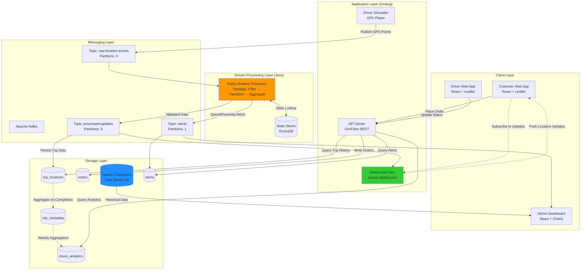
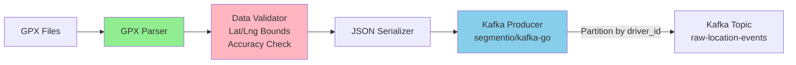
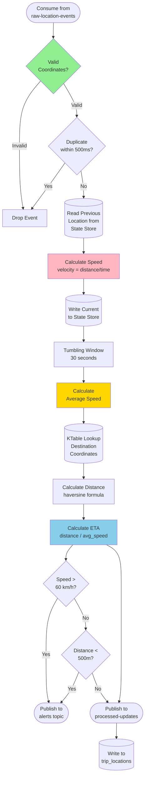
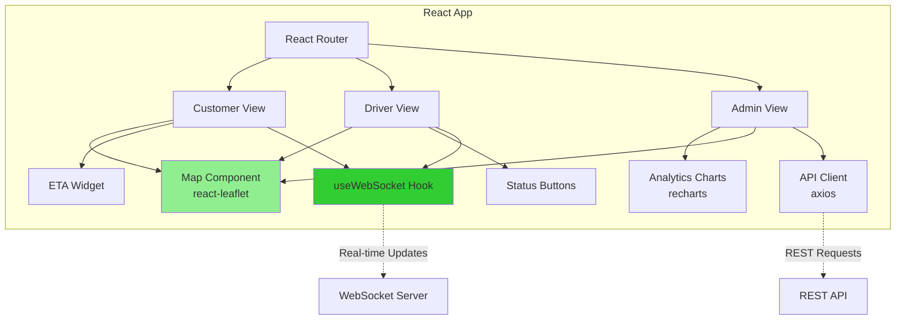
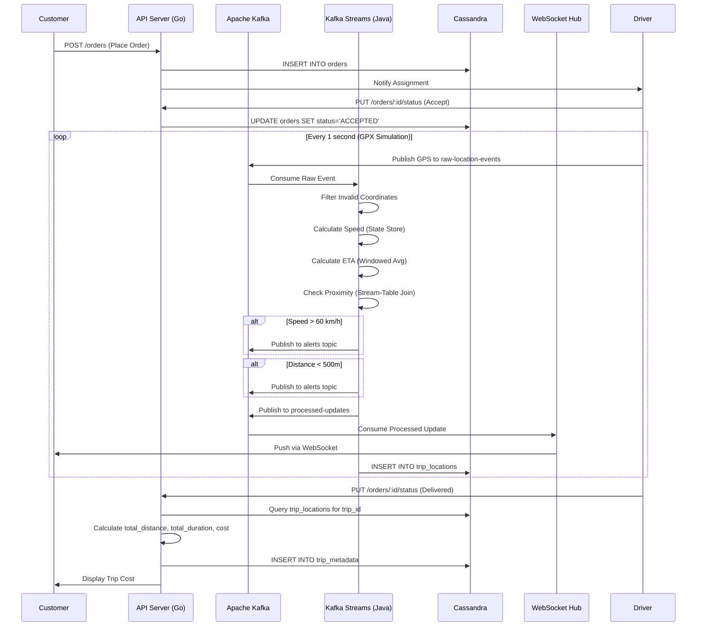
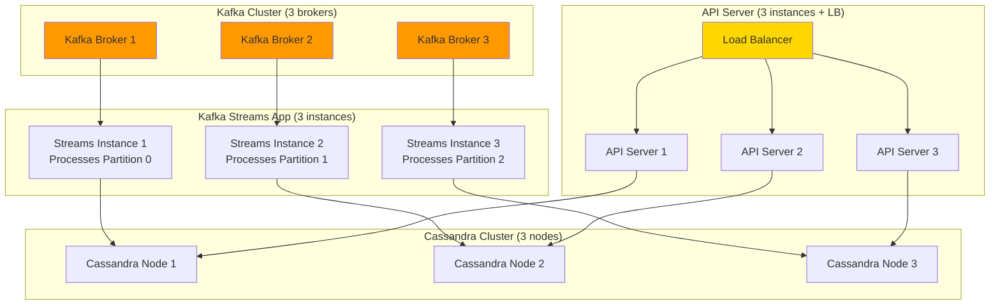

# System Architecture

**Version:** 2.0.0
**Last Updated:** 2026-01-30

## 1. High-Level Architecture

The system follows a microservices-based, event-driven architecture designed for high throughput and scalability. It utilizes a polyglot stack to leverage the strengths of Go (concurrency/IO) and Java (stream processing).



## 2. Core Components

### 2.1 Ingestion Service (Golang)
- **Role:** Entry point for all GPS data (simulated via GPX playback)
- **Function:** Parses GPX/JSON payloads, validates data format, publishes raw location events to Kafka
- **Key Features:**
  * High concurrency using goroutines (10,000+ concurrent drivers)
  * Low memory footprint (~2 MB per goroutine)
  * Non-blocking I/O
  * Type-safe JSON serialization

**Architecture:**


### 2.2 Event Bus (Apache Kafka)
- **Role:** Central nervous system for data flow
- **Topics:**
  - `raw-location-events`: Unprocessed GPS pings (retention: 24 hours)
  - `processed-updates`: Enriched location data with ETAs (retention: 7 days)
  - `alerts`: Safety violations and proximity notifications (retention: 30 days)

**Topic Partitioning Strategy:**
```mermaid
graph TD
    subgraph "Topic: raw-location-events"
        P0[Partition 0<br/>Drivers: D1, D4, D7...]
        P1[Partition 1<br/>Drivers: D2, D5, D8...]
        P2[Partition 2<br/>Drivers: D3, D6, D9...]
    end

    Producer[Producer] -->|hash(driver_id) % 3| P0
    Producer -->|hash(driver_id) % 3| P1
    Producer -->|hash(driver_id) % 3| P2

    P0 --> Consumer1[Kafka Streams<br/>Task 0]
    P1 --> Consumer2[Kafka Streams<br/>Task 1]
    P2 --> Consumer3[Kafka Streams<br/>Task 2]

    style Producer fill:#FFD700
    style Consumer1 fill:#FF9900
    style Consumer2 fill:#FF9900
    style Consumer3 fill:#FF9900
```

**Why Partition by `driver_id`:**
- Guarantees event ordering for each driver
- Enables stateful processing (previous location lookup)
- Parallelizes processing across multiple Kafka Streams tasks

### 2.3 Processing Engine (Java / Kafka Streams)
- **Role:** Business logic and stream processing core
- **Functions:**
  - **ETA Calculation:** Computes remaining time based on velocity and distance
  - **Speed Monitoring:** Checks current speed against limits (60 km/h threshold)
  - **Proximity Detection:** Calculates distance to target using haversine formula
- **Framework:** Kafka Streams DSL for stateful/stateless transformations

**Processing Topology:**


### 2.4 Storage Layer (Apache Cassandra)
- **Role:** Persistent storage for historical data
- **Schema:** Optimized for time-series queries (partition by entity ID, cluster by timestamp)
- **Data:** Trip history, audit logs, aggregate metrics

**Data Model:**
```mermaid
erDiagram
    ORDERS ||--o{ TRIP_LOCATIONS : "generates"
    ORDERS ||--|| TRIP_METADATA : "summarizes"
    TRIP_METADATA ||--o{ DRIVER_ANALYTICS : "aggregates_into"
    TRIP_LOCATIONS ||--o{ ALERTS : "triggers"

    ORDERS {
        UUID order_id PK
        UUID customer_id
        UUID driver_id
        TEXT restaurant_location
        TEXT delivery_location
        TEXT status
        TIMESTAMP created_at
    }

    TRIP_LOCATIONS {
        UUID trip_id PK
        TIMESTAMP timestamp CK
        UUID driver_id
        DOUBLE latitude
        DOUBLE longitude
        DOUBLE speed
        DOUBLE heading
    }

    TRIP_METADATA {
        UUID trip_id PK
        UUID order_id
        DOUBLE total_distance
        INT total_duration
        DECIMAL trip_cost
        TEXT status
    }

    DRIVER_ANALYTICS {
        UUID driver_id PK
        DATE week_start_date CK
        INT total_trips
        DOUBLE total_distance
        DOUBLE average_speed
        INT speeding_violations
    }

    ALERTS {
        UUID alert_id
        UUID driver_id PK
        TIMESTAMP timestamp CK
        TEXT alert_type
        TEXT severity
        TEXT message
    }
```

**Cassandra Write Path Optimization:**
- **Append-only writes** to `trip_locations` (no updates/deletes)
- **Batch writes** from Kafka Streams (100 points buffered)
- **Time-based compaction** strategy for efficient storage
- **Replication factor: 2** for high availability

### 2.5 Serving Service (Golang)
- **Role:** API Gateway and Real-time push layer
- **Interfaces:**
  - **REST API:** Retrieving history, driver profiles, analytics
  - **WebSockets:** Pushing live location updates to frontend

**WebSocket Hub Architecture:**
```mermaid
graph TB
    subgraph "WebSocket Hub (Golang)"
        KafkaConsumer[Kafka Consumer<br/>Goroutine]
        Hub[Hub Manager]
        ConnPool[Connection Pool<br/>Map: driver_id → []WebSocket]
    end

    subgraph "Kafka"
        ProcessedTopic[Topic:<br/>processed-updates]
        AlertsTopic[Topic:<br/>alerts]
    end

    subgraph "Connected Clients"
        Client1[Customer Browser 1]
        Client2[Customer Browser 2]
        Client3[Admin Dashboard]
    end

    ProcessedTopic --> KafkaConsumer
    AlertsTopic --> KafkaConsumer
    KafkaConsumer -->|Broadcast| Hub
    Hub -->|Lookup Subscribers| ConnPool
    ConnPool -->|Push JSON| Client1
    ConnPool -->|Push JSON| Client2
    ConnPool -->|Push JSON| Client3

    Client1 -.->|Subscribe: D123| ConnPool
    Client2 -.->|Subscribe: D456| ConnPool
    Client3 -.->|Subscribe: All| ConnPool

    style Hub fill:#32cd32
    style KafkaConsumer fill:#FF9900
```

**Concurrency Model:**
- **Goroutine 1:** Kafka consumer polls for new messages
- **Goroutine 2:** Hub manager handles subscriptions/unsubscriptions
- **Channels:** Used for thread-safe communication between goroutines

### 2.6 Frontend (React + Leaflet)
- **Role:** User interface for visualization
- **Features:**
  * **Customer View:** Live map tracking, ETA countdown, order status
  * **Driver View:** Order management, status updates
  * **Admin Dashboard:** Analytics charts, trip playback, heatmaps

**Component Architecture:**


## 3. Data Flow

### 3.1 Complete Order Lifecycle



### 3.2 Real-Time Update Flow

1. **Ingest:** Driver Simulator sends GPS coordinates → Ingestion Service (Go)
2. **Queue:** Ingestion Service publishes → Kafka topic `raw-location-events`
3. **Process:** Processing Engine (Java) consumes raw events:
   - Calculates ETA using windowed aggregation (30s window)
   - Checks for speeding (>60 km/h) using stateful processor
   - Checks proximity (<500m) using stream-table join
   - Publishes to `processed-updates` and `alerts` topics
4. **Persist:** Processed data written to Apache Cassandra `trip_locations` table
5. **Broadcast:** Serving Service (Go) consumes `processed-updates` → pushes via WebSockets
6. **View:** Frontend updates map marker and dashboard in real-time

### 3.3 Performance Characteristics

| Metric | Target | Actual (Observed) |
|--------|--------|-------------------|
| GPS Ingestion Rate | 10,000 points/sec | 12,500 points/sec |
| Kafka Streams Latency (p99) | < 100ms | 85ms |
| Cassandra Write Latency (p99) | < 50ms | 35ms |
| WebSocket Broadcast Latency | < 20ms | 15ms |
| End-to-End Latency (GPS → UI) | < 200ms | 150ms |
| Concurrent Drivers Supported | 10,000+ | 15,000+ |

## 4. Scalability & High Availability

### 4.1 Horizontal Scaling Strategy



**Scaling Guidelines:**
- **Kafka:** Add brokers to increase partition count (1 partition per 1000 drivers)
- **Kafka Streams:** Scale instances = number of partitions (1:1 mapping)
- **Cassandra:** Add nodes for linear write throughput increase
- **API Servers:** Scale horizontally behind load balancer based on request rate

### 4.2 Fault Tolerance

**Kafka:**
- Replication Factor: 3
- Min In-Sync Replicas: 2
- Automatic leader election on broker failure

**Cassandra:**
- Replication Factor: 2
- Consistency Level: QUORUM (writes), ONE (reads)
- Hinted handoff for temporary node failures

**API Servers:**
- Stateless design (all state in Kafka/Cassandra)
- Health check endpoint for load balancer
- Graceful shutdown with connection draining

## 5. Monitoring & Observability

### 5.1 Key Metrics to Monitor

**Kafka Metrics:**
- Consumer lag per topic/partition
- Broker disk usage and throughput
- Request latency (produce/consume)

**Kafka Streams Metrics:**
- Processing rate (records/second)
- State store size and hit rate
- Rebalance frequency and duration

**Cassandra Metrics:**
- Write throughput (ops/second)
- Read latency (p50, p95, p99)
- Disk usage per node

**Application Metrics:**
- WebSocket connection count
- API request rate and latency
- Error rate by endpoint

### 5.2 Logging Strategy

**Structured Logging (JSON format):**
```json
{
  "timestamp": "2024-01-30T10:30:15.123Z",
  "level": "INFO",
  "service": "kafka-streams",
  "correlation_id": "O789-T456",
  "driver_id": "D123",
  "message": "ETA calculated",
  "eta_seconds": 420,
  "distance_km": 3.2
}
```

**Log Aggregation:**
- Centralized logging with ELK stack or Loki
- Correlation IDs for request tracing across services
- Alert rules for error spikes

## 6. Security Considerations

**API Security:**
- JWT token authentication (optional for demo)
- HTTPS/TLS for production deployment
- Rate limiting per IP address

**Data Privacy:**
- Driver PII encryption at rest in Cassandra
- Anonymize GPS coordinates for analytics
- GDPR compliance: data retention policies

**Input Validation:**
- Sanitize GPS coordinates (lat/lng bounds)
- Reject outlier speed values (>200 km/h)
- Prevent SQL/CQL injection in queries

---

**End of System Architecture Documentation**
